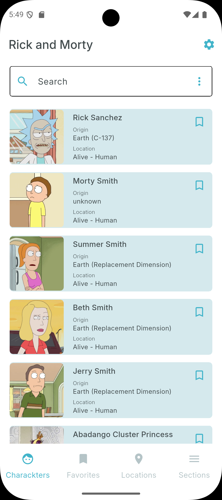
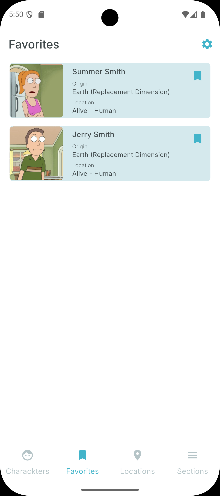
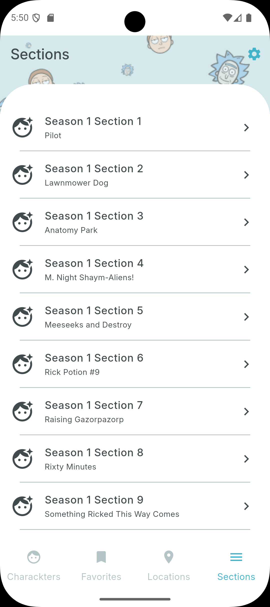

# Rick and Morty - Flutter App 🚀

[](https://flutter.dev/)
[](https://dart.dev/)
[](LICENSE)

<div align="center">
  
</div>

## 📱 Overview

A feature-rich, cross-platform mobile application built with Flutter that explores the multiverse of Rick and Morty. The app provides fans with an immersive experience to browse characters, episodes, locations, and more from the popular animated series.

---

## ✨ Key Features

### 🎭 Character Exploration
- **Complete Character Catalog**: Browse all 800+ characters from the series
- **Advanced Filtering**: Filter by status (Alive/Dead/Unknown), species, gender, and dimension
- **Detailed Profiles**: View character details including origin, location, and episode appearances
- **Favorites System**: Bookmark your favorite characters for quick access
- **Shimmer Loading Effects**: Beautiful animated loading states for smooth user experience

### 📺 Episode Guide
- **Season-by-Season Organization**: All episodes from all seasons
- **Episode Details**: Synopsis, air date, and featured characters
- **Watch Status Tracker**: Mark episodes as watched
- **Episode Cast**: See which characters appear in each episode

### 🌍 Location Browser
- **Multiverse Map**: Explore different dimensions and planets
- **Location Details**: Type, dimension, and resident characters
- **Search by Dimension**: Find locations across the multiverse

---

## 🛠 Technical Implementation

### Tech Stack & Versions
- **Flutter**: 3.22.0+ (Latest stable)
- **Dart**: 3.4.0+ (With records, patterns, and sealed classes)
- **Minimum SDK**:
  - Android: API 24 (Android 7.0)
  - iOS: 13.0

### Architecture & Design Patterns
- **Provider**: State management and dependency injection
- **ChangeNotifier**: Reactive UI updates
- **Service Locator**: Using `get_it` for service registration
- **Clean Architecture**: Separation of concerns with models, services, and views

### Key Packages
- `dio`: HTTP client for API calls
- `go_router`: Declarative routing
- `provider`: State management
- `shimmer`: Animated loading effects
- `shared_preferences`: Local data persistence
- `get_it`: Dependency injection

---

## 🎨 Animation & UI Features

### Shimmer Effects
The app uses beautiful shimmer animations for loading states, providing a modern and polished user experience:
- Character card loading animations
- Episode list loading states
- Smooth transitions between states

### Animations
- **Favorite Button Animation**: Scale and rotation effects when favoriting characters
- **Hero Animations**: Smooth transitions between screens
- **Shimmer Loading**: Skeleton screens with animated shimmer effects

---

## 🚀 Getting Started

### Prerequisites
- Flutter SDK 3.22.0 or higher
- Dart SDK 3.4.0 or higher
- Android Studio / Xcode (for mobile development)
- A code editor (VS Code, Android Studio, IntelliJ IDEA)

### Installation

1. **Clone the repository**
   ```bash
   git clone https://github.com/Mrxforte/rick_and_morty.git
   cd rick_and_morty
   ```

2. **Install dependencies**
   ```bash
   flutter pub get
   ```

3. **Run the app**
   ```bash
   # Run on connected device
   flutter run

   # Run on specific platform
   flutter run -d android    # Android
   flutter run -d ios        # iOS (Mac only)
   flutter run -d chrome     # Web
   flutter run -d windows    # Windows
   flutter run -d macos      # macOS
   flutter run -d linux      # Linux
   ```

---

## 🏗 Build Instructions

### Debug Build
```bash
flutter build apk --debug          # Android APK
flutter build ios --debug          # iOS
flutter build web                  # Web
```

### Release Build
```bash
flutter build apk --release        # Android APK
flutter build appbundle --release  # Android App Bundle
flutter build ios --release        # iOS (requires signing)
flutter build web --release        # Web (optimized)
```

---

## 🧪 Testing

Run the test suite:
```bash
# Run all tests
flutter test

# Run tests with coverage
flutter test --coverage

# Run specific test file
flutter test test/widget_test.dart
```

---

## 📸 Screenshots

<div align="center">
  
  
  
  
</div>

---

## 📁 Project Structure

```
lib/
├── app/              # App configuration (routing, theme, locator)
├── models/           # Data models
├── services/         # API and local services
└── views/
    ├── screens/      # Screen widgets
    └── widgets/      # Reusable widgets (including shimmer effects)
```

---

## 🤝 Contributing

Contributions are welcome! Please feel free to submit a Pull Request.

1. Fork the repository
2. Create your feature branch (`git checkout -b feature/AmazingFeature`)
3. Commit your changes (`git commit -m 'Add some AmazingFeature'`)
4. Push to the branch (`git push origin feature/AmazingFeature`)
5. Open a Pull Request

---

## 📝 License

This project is licensed under the MIT License - see the [LICENSE](LICENSE) file for details.

---

## 🙏 Acknowledgments

- [Rick and Morty API](https://rickandmortyapi.com/) for providing the data
- Flutter team for the amazing framework
- All contributors who helped improve this project

---

<div align="center">
  <strong>Made with ❤️ and Flutter</strong>
</div>
